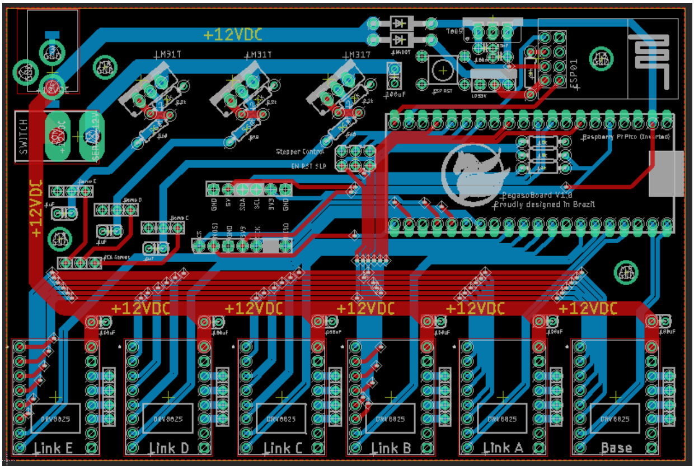

# Bill of materials (kind of)

This document lists the main materials I used to build the robot vehicle.

## Chassis

- 500g PETG (approx.)
- 4x rubber seal for PVC pipes (d=50mm)

Obs.: All the vehicle structure parts were designed to be 3D printed with no need for supports
and targeting M3 bolts everywhere. There is no mandatory choice of material - PLA, although not
recommended for mechanical usage, was tested on this project and worked out successfuly.

However, my suggestion is to use **PETG** wherever possible, specially on more demanded parts
such as the wheel axles and main frame. PETG offers a less brittle reaction to force, a higher
temperature tolerance than PLA and a much easier printing experience than ABS.

## Bolts

- 20x M3x8mm
- 20x M3x18mm

Obs.: I don't have exact numbers right now, but all M3 screws were between 8mm and 18mm deep.
Think 20 of each and use the remainder to power your other DIY projects. Some holes are
meant to be screwed in and thus will be tight, others are meant to just be pass-through.
You are more than welcome to test using threaded inserts (if you do let mw know how it went!).

## Eletronics

Motors and drivers:
- 1x NEMA 17HS3401 stepper motor (for powertrain)
- 1x 28BYJ-48 stepper motor (for steering)
- 1x DRV8825 stepper motor driver
- 1x ULN2003 stepper motor driver

Microcontrollers:
- 1x Raspberry Pi Pico (main controller)
- 1x ESP-01s (WiFi and web interface)

Energy:
- 1x KDC-11 switch
- 1x step-up XL6009 5V-12V converter
- 1x powerbank (recommended: 10000 mAh or higher)
- 1x LD33V (THT package) (3V3 supply for ESP-01s)
- 1x L7805CV (THT package) (5V supply for Raspberry Pi Pico)

Wiring:
- 6x jumpers for ULN2003 driver (4x step pins and 2x power pins)
- 5x jumpers for DRV8825 driver (slp, rst, en, step and dir pins)
- 2x thicker wires for 12V power delivery on board

Obs.: Of course you can switch to a Raspberry Pico W instead of two microcontrollers and
also swap the powerbank for a bunch of AA batteries. The list reflects the project as it was
made by me, using a board I designed years ago when there was no Pico W yet, and the powerbank
just makes your life so much cheaper and easier on the long run when the batteries die, also
serving as what powerbanks are primarily supposed to do when the robot is not in use.

However, they are limited to a 5V supply (unless you perform some magic on your energy circuit
to trick it into supplying more) and the NEMA stepper driver requires a 9V+ source to operate.
That's why the step-up converter is needed.

As for the wiring it's hard to specify, as it will be subjective to each one's design, but
a safe bet would definitely be having at least 10x of each type (MM, MF, FF). **DON'T** try to
use jumpers between the power bank and the 5-12V converter, as it runs a decent amount of
current and will likely **MELT** the jumpers.

## PegasoBoard V1.0

The PegasoBoard is a carrier board for most of the aforementioned components and was originally
designed by me to be used in a [robot arm](https://bdm.unb.br/handle/10483/34423). That's why it
has 6 slots for stepper drivers a 3 slots for servo motors, with voltage regulators for each
servo. I had a few spare boards with me and that's why they are used in the project, saving a
lot of trouble with board connections on a generic PCB or a clumsy protoboard contraption.

The files for the board are saved elsewhere and are intended to be made available soon for anyone
wishing to order on JLCPCB or similar services. All resistor values and components are printed
on the board and all components are meant to go on one side only.

Future work on this project involves designing a board specific for this project, which will be
presumably way smaller as most components of the PegasoBoard are not needed here.